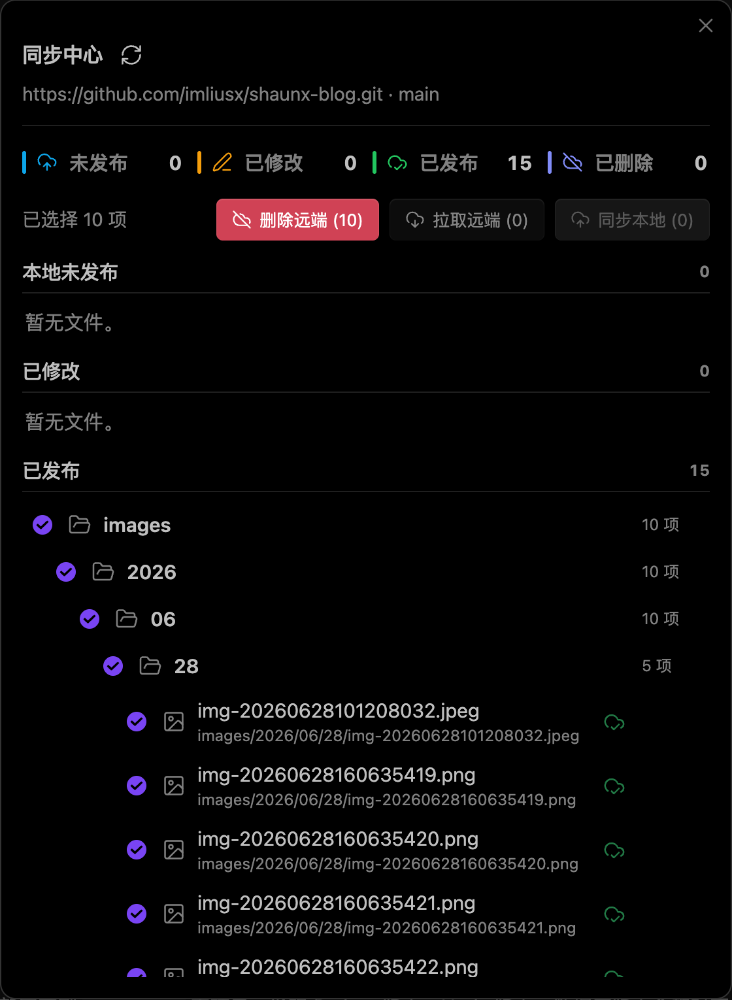
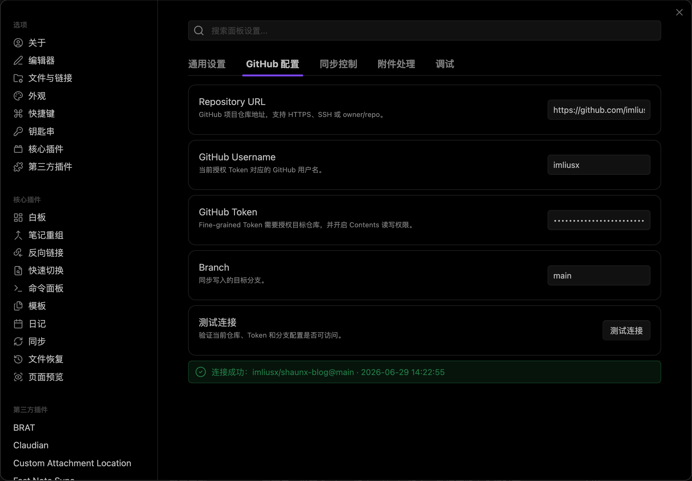

# Obsidian Git Syncer

Obsidian Git Syncer 是一个用于把 Obsidian Vault 中的文章同步到 GitHub 仓库 `content/` 目录的插件。它适合使用 GitHub 作为博客内容仓库的场景：在 Obsidian 写作，确认后选择文件或目录发布到远端。

插件只读写远端仓库的 `content/` 目录，不会操作仓库其他目录。

## Screenshots

### 同步中心



### 插件设置



## 功能

- 配置 GitHub 仓库地址、GitHub 用户名、Token、目标分支和本地同步目录。
- 只读写 GitHub 仓库的 `content/` 目录。
- 支持 Markdown、图片和其他普通资源文件同步。
- 提供同步中心，自动比对本地与远端文件状态。
- 支持按文件或目录选择后批量同步、拉取远端、删除远端。
- 支持识别未发布、已修改、已发布、本地已删除等状态。
- 支持本地已删除但远端仍存在的文件清理。
- 支持远端存在但本地不存在的文件拉取到本地。
- 支持插入博客文章 frontmatter 模板。
- 同步失败时显示具体失败文件和失败原因。

## 安装

### 使用 BRAT

1. 在 Obsidian 中安装并启用 BRAT 插件。
2. 打开 BRAT 设置，选择添加 Beta plugin。
3. 填入仓库地址：

```text
https://github.com/imliusx/obsidian-git-syncer
```

4. 安装完成后，在 Obsidian 的第三方插件列表中启用 Obsidian Git Syncer。

### 手动安装

从 GitHub Release 下载以下文件，并放入 Vault 的插件目录：

```text
.obsidian/plugins/obsidian-git-syncer/
```

需要的文件：

- `main.js`
- `manifest.json`
- `styles.css`

## GitHub Token 权限

建议使用 GitHub Fine-grained personal access token。

Token 配置：

- Repository access：选择目标博客仓库。
- Repository permissions：将 `Contents` 设置为 `Read and write`。

插件会通过 GitHub Contents API 和 Git Tree API 读取远端 `content/` 目录，并把选中的本地文件写入 `content/` 下的对应路径。

## 配置项

在插件设置页配置：

- Repository URL：目标 GitHub 仓库地址，例如 `https://github.com/owner/repo.git`。
- GitHub Username：Token 所属 GitHub 用户名。
- GitHub Token：具有 `Contents: Read and write` 权限的 Token。
- Branch：目标分支，例如 `main`。
- Local Root Path：本地同步根目录。可以选择某个 Vault 内目录，也可以使用 `/` 表示 Vault 根目录。

远端目录固定为：

```text
content/
```

## 路径映射

本地文件会按 Local Root Path 下的相对路径映射到远端 `content/` 目录。

例如 Local Root Path 为 `posts`：

```text
posts/java/demo.md -> content/java/demo.md
```

如果 Local Root Path 为 `/`：

```text
demo.md -> content/demo.md
images/a.png -> content/images/a.png
```

注意：如果 Local Root Path 为 `/`，本地 `content/demo.md` 会映射为远端 `content/content/demo.md`。

## 同步中心

同步中心会自动拉取远端 `content/` 目录树，并扫描本地同步目录，按状态展示文件：

- 未发布：本地存在，远端不存在。
- 已修改：本地和远端都存在，但内容不同。
- 已发布：本地和远端内容一致。
- 已删除：远端存在，本地不存在。

可执行操作：

- 同步本地：将选中的本地文件发布到远端。
- 拉取远端：将选中的远端文件拉取到本地。
- 删除远端：删除选中文件在远端仓库中的文件。

目录支持折叠、展开和批量选择。

## Frontmatter 模板

插件可为当前 Markdown 文件插入文章属性模板：

```yaml
---
title: 文章标题
slug: article-slug
date: 2026-06-30
category: 开发
tags:
  - Java
  - NextJS
description: 文章摘要
cover:
published: true
---
```

`category` 建议使用以下类别之一：

```text
架构、开发、原理、AI栈、运维、工具、硬件、随笔
```

## 开发

安装依赖：

```bash
npm install
```

构建：

```bash
npm run build
```

构建产物：

- `main.js`
- `manifest.json`
- `styles.css`

## Release

BRAT 使用 GitHub Release 中的 `main.js`、`manifest.json` 和 `styles.css`。发版时需要确保版本号同步更新：

- `package.json`
- `package-lock.json`
- `manifest.json`
- `versions.json`
